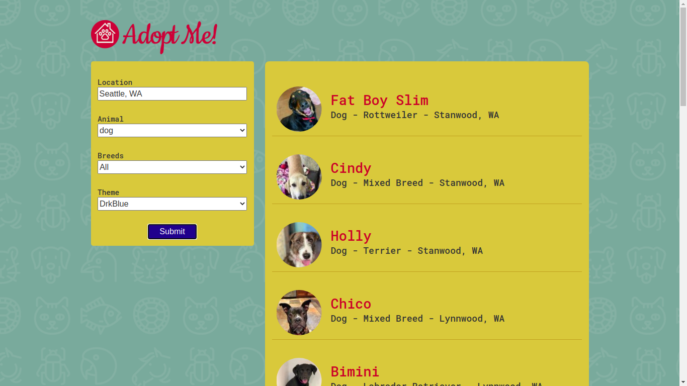

# Pet Adoption App with ReactJS

This project idea is to help and find new home for pet who neeed help and love.

This project use the basic concept of React like function/class component, Props , State, Hooks, Life Cycle Methods, Error Bondaries, Context, Poratal and Refs.

API are comming from https://www.petfinder.com
